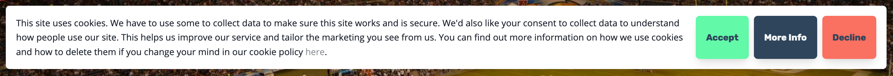

# Arcspire Cookie Banner 🍪

The Arcspire Cookie Banner provides an easy and customisable way to get cookie consent from visitors on your site.



## Demo

If you'd like to see the banner in action and some of the different ways it can be customised to suit your needs, you can do so [here](https://arcspire.github.io/cookie-banner/).

## Getting Started

1. Place the following script at the bottom of your `<body>` or if you are going to alter the styling of the banner place it above your css in your `<head>`.

```html
<script src="https://public.arcspire.io/js/cookie-banner_v0.1.0.min.js"></script>
```

2. To initialise, just call the function `cookieBanner()` with options if needed.

```js
// default
cookieBanner()
```

```js
// with options
cookieBanner({
    text: `My custom text`,
    fullScreen: true,
    // see more options below...
})
```

## Options

| Name                  | Type       | Default                                                                          | Description                                                                                                                                                                                         |
| --------------------- | ---------- | -------------------------------------------------------------------------------- | --------------------------------------------------------------------------------------------------------------------------------------------------------------------------------------------------- |
| `text`                | `string`   | This website uses cookies. By clicking 'Accept' you agree to our use of cookies. | The primary text to appear on the banner.                                                                                                                                                           |
| `acceptText`          | `string`   | Accept                                                                           | The text that appears on the Accept button.                                                                                                                                                         |
| `rejectText`          | `string`   | Reject                                                                           | The text that appears on the Reject button.                                                                                                                                                         |
| `moreText`            | `string`   | More Info                                                                        | The text that appears on the More Info button.                                                                                                                                                      |
| `preferencesText`     | `string`   | Preferences                                                                      | The text that appears on the Preferences button.                                                                                                                                                    |
| `overlayTheme`        | `string`   | dark                                                                             | When using the banner in `fullScreen` mode, the theme of the background behind the banner. The options are `dark` or `light`.                                                                       |
| `bannerTheme`         | `string`   | light                                                                            | The theme of the banner background. The options are `dark` or `light`.                                                                                                                              |
| `preferencesSaveText` | `string`   | Save                                                                             | The text that appears on the Save button once the preferences pane is open.                                                                                                                         |
| `title`               | `string`   |                                                                                  | Optional title for the banner.                                                                                                                                                                      |
| `onAccept`            | `function` |                                                                                  | What to do when the user clicks on the accept button. Code will automatically close the banner and remember the user has accepted by storing `cb-cookiesAccepted` in `localStorage`.                |
| `onReject`            | `function` |                                                                                  | What to do when the user click on the reject button. Code will automatically close the banner.                                                                                                      |
| `onMore`              | `function` |                                                                                  | What to do when the user clicks on the more info button.                                                                                                                                            |
| `fullScreen`          | `boolean`  |                                                                                  | Whether you want the cookie banner to appear at the bottom of the screen like a little pop-up or full screen whether the user cannot interact with the rest of the page until w they accept/reject. |
| `parentClass`         | `string`   |                                                                                  | Give the banner a class so you can go on to customise the banner as you wish in your css.                                                                                                           |
| `preferences`         | `array`    |                                                                                  | An array of objects e.g `[{ name: 'marketing', label: 'Marketing' }]` if you want to give the user the ability to only accept particular cookies.                                                   |
| `onPreferencesAccept` | `function` |                                                                                  | What to do when the user chooses to accept particular cookies according to their preferences. Function will provide a `values` object mapping their preferences to boolean values.                  |

## Styling

To override any of the default styling of the cookie banner, we first recommend providing the `parentClass` option when initialising the cookie banner. In your own css, you can then just prefix any of the ID's we have set with the class name you just made.

```js
cookieBanner({
    parentClass: `my-cookie-banner`,
})
```

```css
/* change the bg colour of the banner to red */
.my-cookie-banner #cb-banner {
    background-color: red;
}

/* give the accept button a green bg color, black border and white text */
.my-cookie-banner #cb-accept {
    background-color: green;
    border: 2px solid black;
    color: white;
}
```

## Examples

-   [Arcspire](https://arcspire.io)

## License

[MIT](https://github.com/Arcspire/cookie-banner/blob/master/LICENSE.txt)
